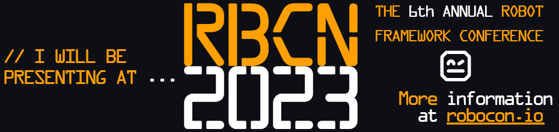

- 👋 Hi, I’m @Noordsestern
- 👀 I’m interested in open source, gardening, smart home, in general everything implemented in Python.
- 🌱 I’m currently learning BPMN
- 💞️ I’m looking to collaborate on test- and process automation.

